# CICD Tools Project - Detailed Architecture Plan

## 1. Project Overview

The cicd_tools project will be a flexible framework for development tasks including project creation, testing, building, and deployment. It will feature:

- Dynamic menus that adapt based on project type
- Template-based project creation and updates using Copier
- Support for multiple project types with different capabilities
- Integration with GitHub workflows for CI/CD
- Comprehensive environment management

## 2. Project Structure

```
cicd_tools/
├── pyproject.toml
├── README.md
├── cicd_tools/
│   ├── __init__.py
│   ├── cli.py                   # Main entry point
│   ├── menus/                   # Menu system components
│   │   ├── __init__.py
│   │   ├── create_menu.py       # Project creation/update menu
│   │   ├── app_menu.py          # Project-specific operations menu
│   │   └── menu_utils.py        # Common menu utilities
│   ├── project_types/           # Project type implementations
│   │   ├── __init__.py
│   │   ├── base_project.py      # Abstract base class
│   │   ├── simple_project.py
│   │   ├── development_project.py
│   │   └── github_project.py
│   ├── templates/               # Template management
│   │   ├── __init__.py
│   │   ├── template_manager.py  # Copier integration
│   │   └── template_utils.py    # Template helpers
│   └── utils/                   # Utility functions
│       ├── __init__.py
│       ├── env_manager.py       # Adapted from existing env_manager
│       └── config_manager.py    # Project configuration
├── project_templates/           # Copier templates
│   ├── simple_project/
│   ├── development_project/
│   └── github_project/
└── tests/                       # Test suite
    ├── __init__.py
    ├── conftest.py
    └── ...
```

## 3. Core Components

### 3.1 Project Types

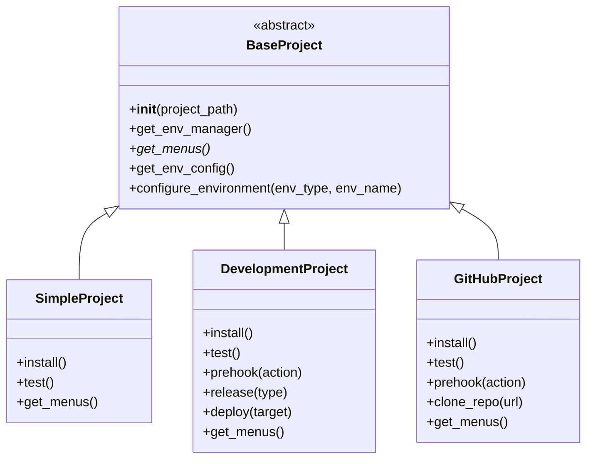

The project type system follows the Strategy pattern, enabling dynamic behavior based on project type. Each project type implements specific operations and provides appropriate menus.

### 3.2 Menu System

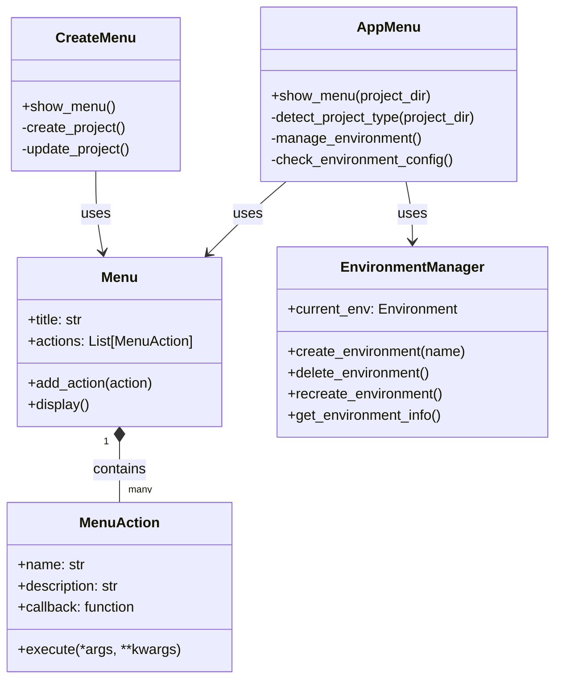

The menu system dynamically adapts based on project type, presenting appropriate options to the user. The Command pattern is used for menu actions, improving maintainability and extensibility.

### 3.3 Template Management

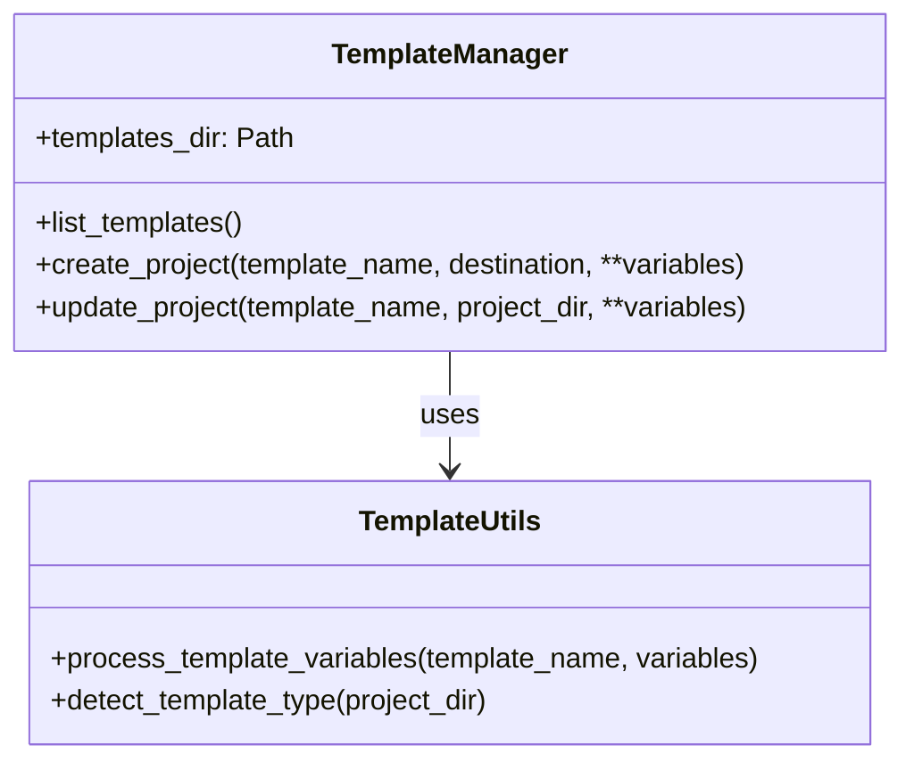

Template management integrates with Copier to handle project creation and updates. Templates will be stored in a dedicated directory structure with proper separation of concerns.

### 3.4 Environment Management

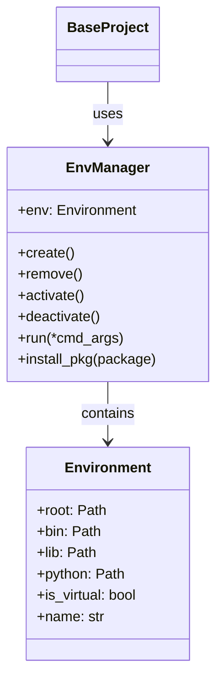

We'll adapt the existing `env_manager` module to provide environment management capabilities, focusing on the elements needed for cicd_tools without unnecessary complexity.

## 4. Key Workflows

### 4.1 Project Creation

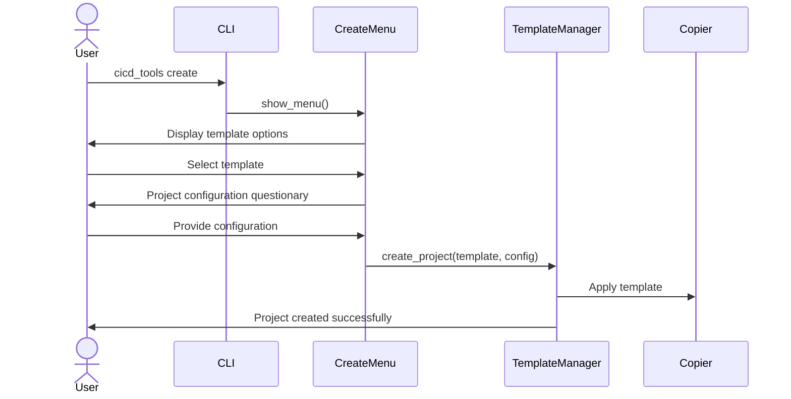

### 4.2 Environment Configuration Check

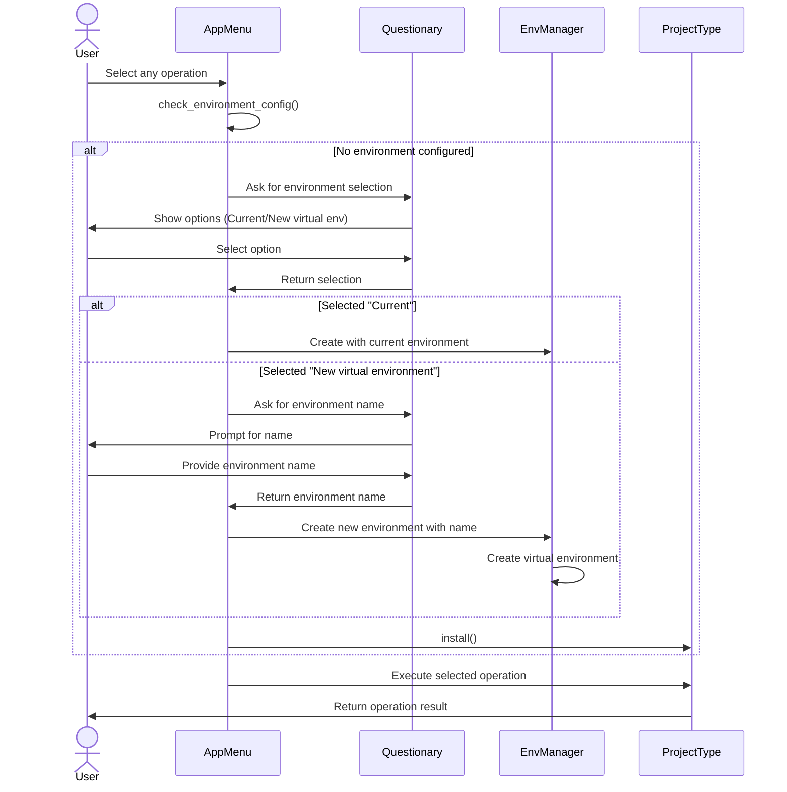

### 4.3 Environment Management Menu

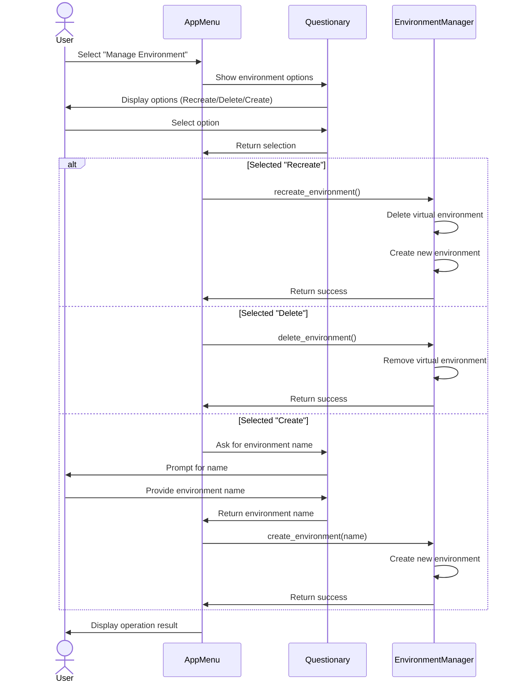

### 4.4 App Operations by Project Type

#### 4.4.1 Simple Project - Build Operation

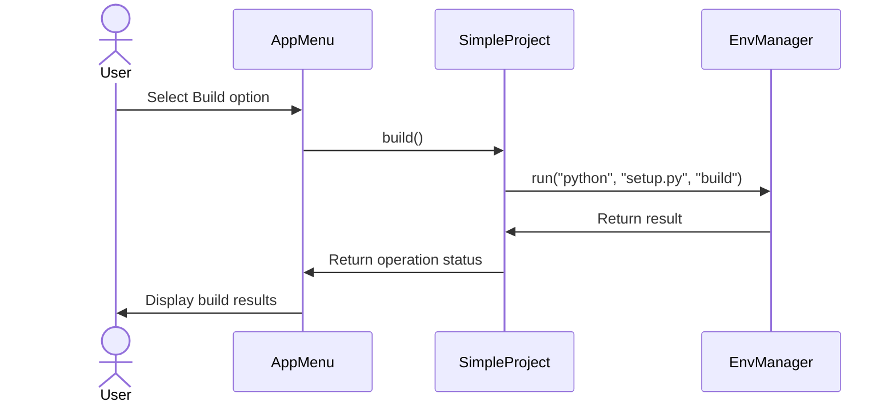

#### 4.4.2 Development Project - Install Operation

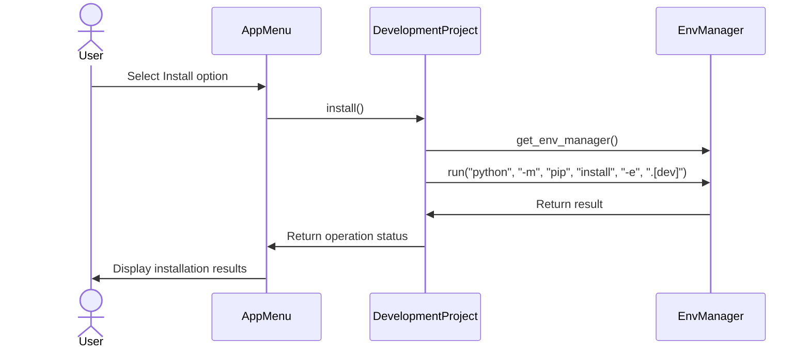

#### 4.4.3 Development Project - Test Operation

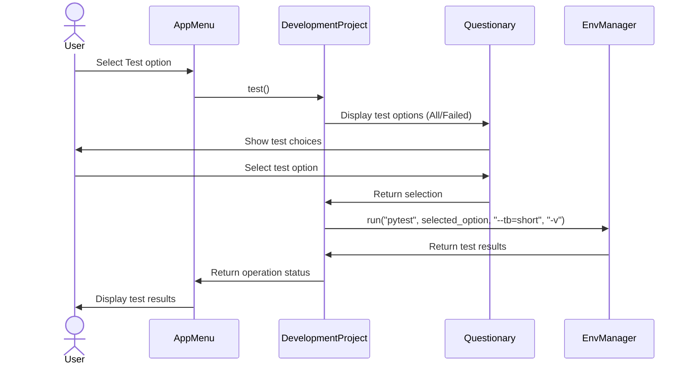

#### 4.4.4 Development/GitHub Project - Prehook Operation

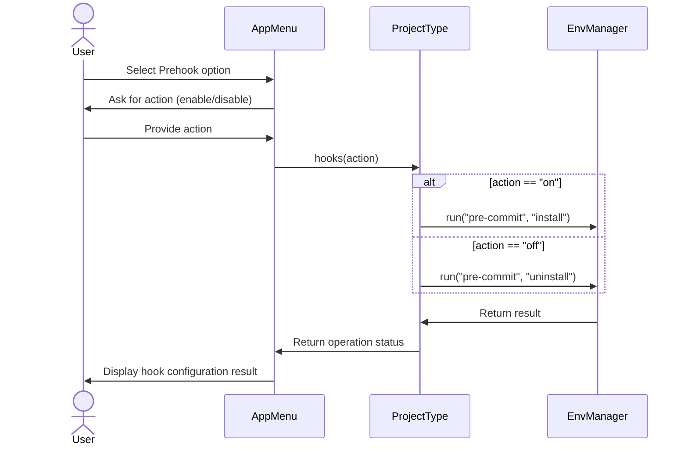

#### 4.4.5 Development Project - Release Operation

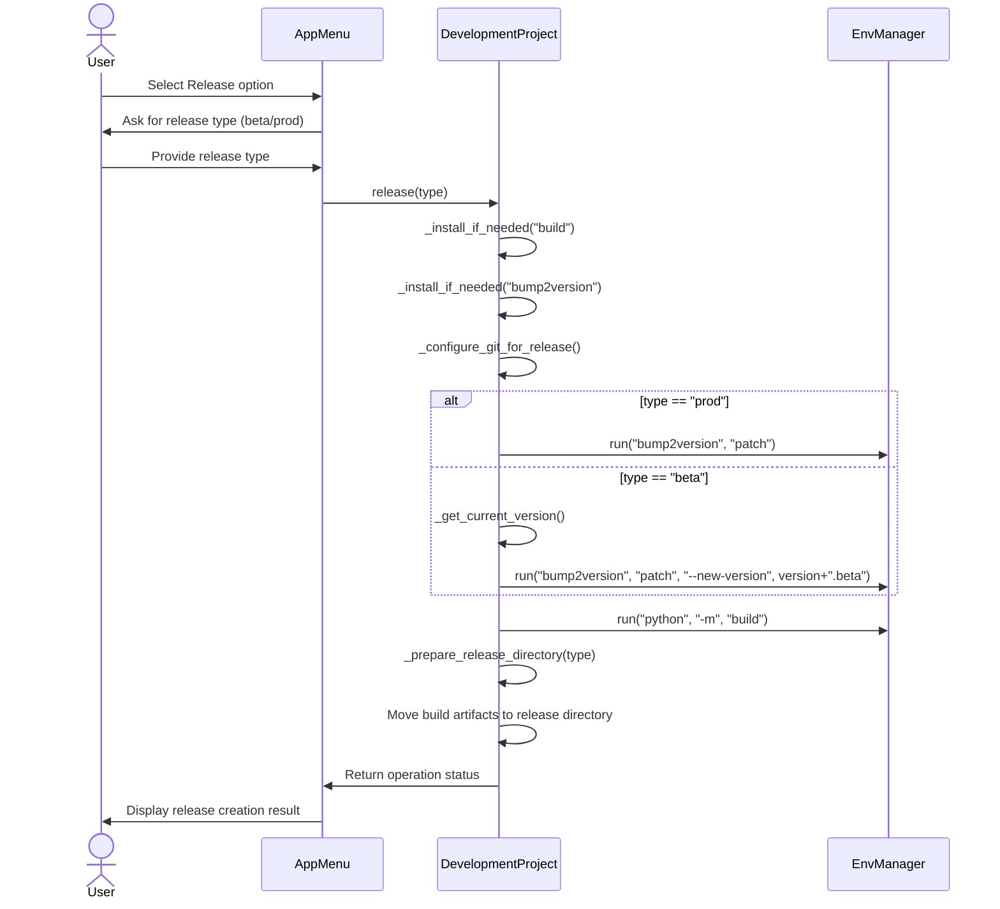

#### 4.4.6 Development Project - Deploy Operation

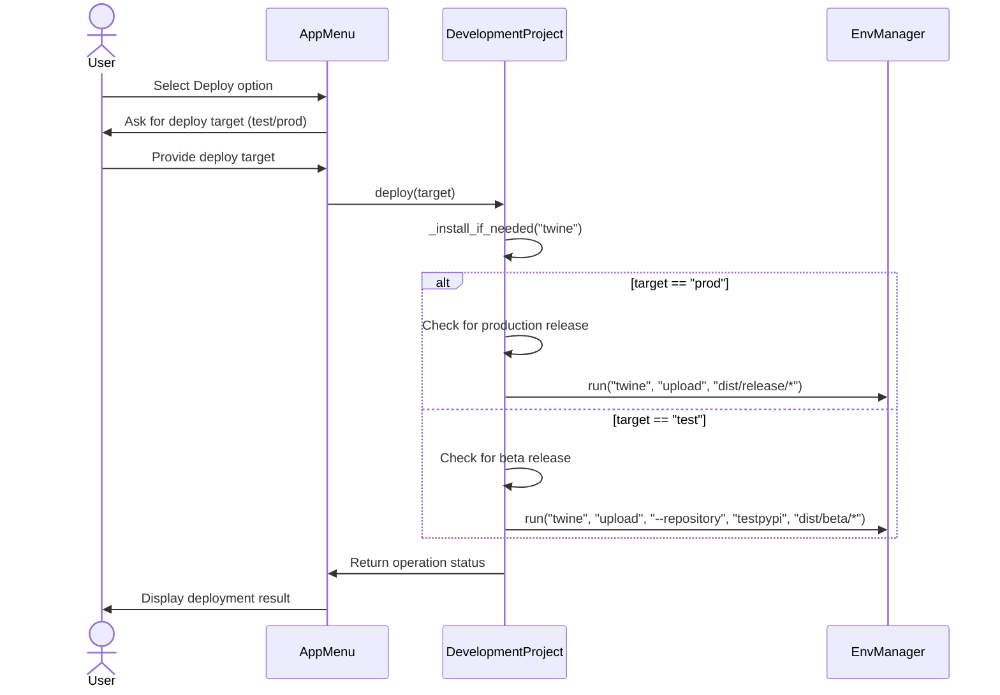

#### 4.4.7 GitHub Project - Clone Repository Operation

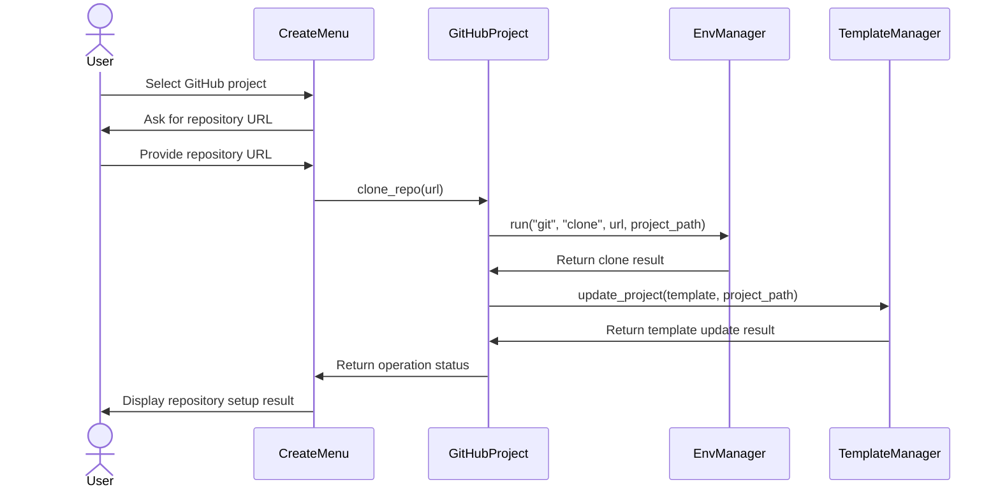

#### 4.4.8 Help Operation (Common to all project types)

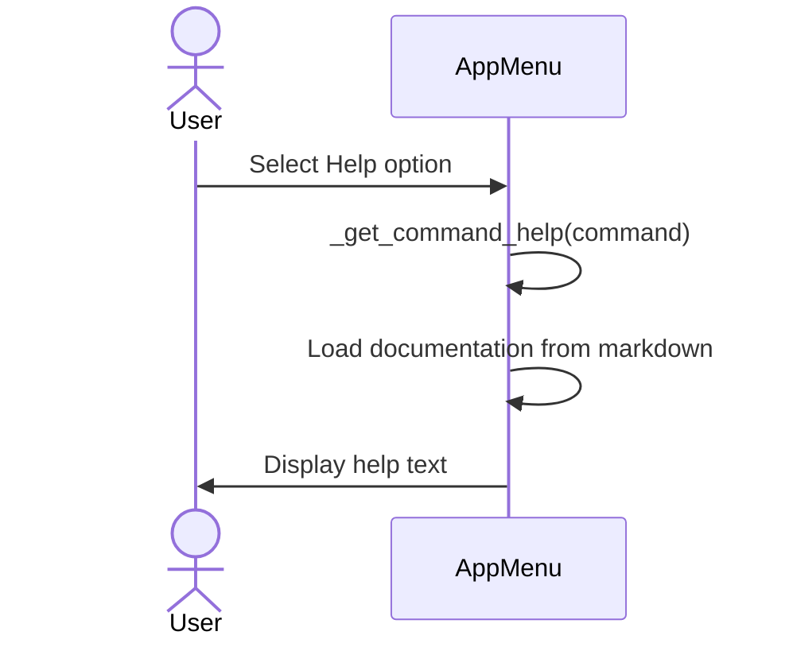

## 5. Implementation Approach

### 5.1 SOLID Principles Application

1. **Single Responsibility Principle**: Each class has a single responsibility
   - ProjectType classes handle project-specific logic
   - MenuSystem handles user interaction
   - TemplateManager handles template operations
   - EnvironmentManager handles environment tasks

2. **Open/Closed Principle**: Open for extension, closed for modification
   - New project types can be added without modifying existing code
   - Menu system can be extended with new actions
   - Environment management is extensible

3. **Liskov Substitution Principle**: Subtypes are substitutable for base types
   - All ProjectType implementations can be used interchangeably
   - Base classes define clear contracts for subclasses

4. **Interface Segregation Principle**: Clients only depend on methods they use
   - Clear interfaces for each component
   - No forced dependencies on unused functionality
   - BaseProject only includes methods common to all project types

5. **Dependency Inversion Principle**: High-level modules depend on abstractions
   - Core components depend on interfaces, not concrete implementations
   - Dependency injection used where appropriate

### 5.2 GitHub Workflow Configurations

#### 5.2.1 pytest.yml Workflow

The pytest workflow will run automated tests on push and pull requests:

- Uses matrix strategy for multiple Python versions
- Configures caching for faster execution
- Reports test results

```yaml
name: Tests

on:
  push:
    branches: [ main ]
  pull_request:
    branches: [ main ]

jobs:
  test:
    runs-on: ubuntu-latest
    strategy:
      matrix:
        python-version: [3.8, 3.9, '3.10', '3.11', '3.12']

    steps:
    - uses: actions/checkout@v3
    
    - name: Set up Python ${{ matrix.python-version }}
      uses: actions/setup-python@v4
      with:
        python-version: ${{ matrix.python-version }}
        
    - name: Cache pip dependencies
      uses: actions/cache@v3
      with:
        path: ~/.cache/pip
        key: ${{ runner.os }}-pip-${{ hashFiles('**/pyproject.toml') }}
        restore-keys: |
          ${{ runner.os }}-pip-
          
    - name: Install dependencies
      run: |
        python -m pip install --upgrade pip
        pip install -e .[dev]
        
    - name: Run tests
      run: |
        pytest --cov=cicd_tools
```

#### 5.2.2 release.yml Workflow

The release workflow will handle version management and build operations:

- User-triggered workflow with version selection
- Automatic version bumping using bump2version
- Conditional logic for production vs. beta releases

```yaml
name: Release

on:
  workflow_dispatch:
    inputs:
      release_type:
        description: 'Release Type'
        required: true
        default: 'beta'
        type: choice
        options:
          - beta
          - prod

jobs:
  release:
    runs-on: ubuntu-latest
    
    steps:
    - uses: actions/checkout@v3
      with:
        fetch-depth: 0
    
    - name: Set up Python
      uses: actions/setup-python@v4
      with:
        python-version: '3.10'
        
    - name: Install dependencies
      run: |
        python -m pip install --upgrade pip
        pip install build bump2version twine
        
    - name: Configure Git
      run: |
        git config --local user.email "actions@github.com"
        git config --local user.name "GitHub Actions"
        
    - name: Bump version (Production)
      if: ${{ github.event.inputs.release_type == 'prod' }}
      run: |
        bump2version patch
        
    - name: Bump version (Beta)
      if: ${{ github.event.inputs.release_type == 'beta' }}
      run: |
        current_version=$(grep -o 'current_version = "[^"]*' .bumpversion.cfg | cut -d'"' -f2)
        bump2version patch --new-version "${current_version}.beta"
        
    - name: Build package
      run: |
        python -m build
        
    - name: Create release directory
      run: |
        mkdir -p dist/${{ github.event.inputs.release_type }}
        cp dist/*.whl dist/${{ github.event.inputs.release_type }}/
        cp dist/*.tar.gz dist/${{ github.event.inputs.release_type }}/
        
    - name: Upload artifacts
      uses: actions/upload-artifact@v3
      with:
        name: release-${{ github.event.inputs.release_type }}
        path: dist/${{ github.event.inputs.release_type }}/*
```

#### 5.2.3 deploy.yml Workflow

The deploy workflow will handle deployment to PyPI:

- User-guided artifact selection
- Conditional deployment targets (test.pypi or main PyPI)
- Proper use of secrets

```yaml
name: Deploy

on:
  workflow_dispatch:
    inputs:
      deploy_target:
        description: 'Deployment Target'
        required: true
        default: 'test'
        type: choice
        options:
          - test
          - prod

jobs:
  deploy:
    runs-on: ubuntu-latest
    
    steps:
    - uses: actions/checkout@v3
    
    - name: Set up Python
      uses: actions/setup-python@v4
      with:
        python-version: '3.10'
        
    - name: Install dependencies
      run: |
        python -m pip install --upgrade pip
        pip install twine
        
    - name: Download beta artifacts
      if: ${{ github.event.inputs.deploy_target == 'test' }}
      uses: actions/download-artifact@v3
      with:
        name: release-beta
        path: dist/beta
        
    - name: Download production artifacts
      if: ${{ github.event.inputs.deploy_target == 'prod' }}
      uses: actions/download-artifact@v3
      with:
        name: release-prod
        path: dist/release
        
    - name: Deploy to TestPyPI
      if: ${{ github.event.inputs.deploy_target == 'test' }}
      env:
        TWINE_USERNAME: ${{ secrets.TEST_PYPI_USERNAME }}
        TWINE_PASSWORD: ${{ secrets.TEST_PYPI_PASSWORD }}
      run: |
        twine upload --repository testpypi dist/beta/*
        
    - name: Deploy to PyPI
      if: ${{ github.event.inputs.deploy_target == 'prod' }}
      env:
        TWINE_USERNAME: ${{ secrets.PYPI_USERNAME }}
        TWINE_PASSWORD: ${{ secrets.PYPI_PASSWORD }}
      run: |
        twine upload dist/release/*
```

## 6. Development Steps

1. Set up project structure and dependencies
2. Implement core interfaces and base classes
3. Develop template management system
4. Implement project type classes
5. Create menu system with dynamic adaptation
6. Implement environment management
7. Develop project templates for each project type
8. Implement GitHub workflow configurations
9. Write comprehensive tests and documentation

## 7. Technical Considerations

### 7.1 Dependencies

- **Questionary**: For interactive command prompts
- **Copier**: For template-based project creation and updates
- **PyYAML**: For configuration handling
- **Click**: For CLI interface (optional, can use argparse)

### 7.2 Error Handling

- Comprehensive error handling with descriptive messages
- Graceful failure modes with recovery options
- Proper logging at appropriate levels

### 7.3 Testing Strategy

- Unit tests for individual components
- Integration tests for workflow verification
- Mocking for external dependencies

## 8. Future Extensibility

The architecture is designed for future expansion:
- Additional project types can be added by creating new classes
- New menu actions can be registered dynamically
- Template system supports custom template variables and functions
- Environment management system can be extended for additional configuration options