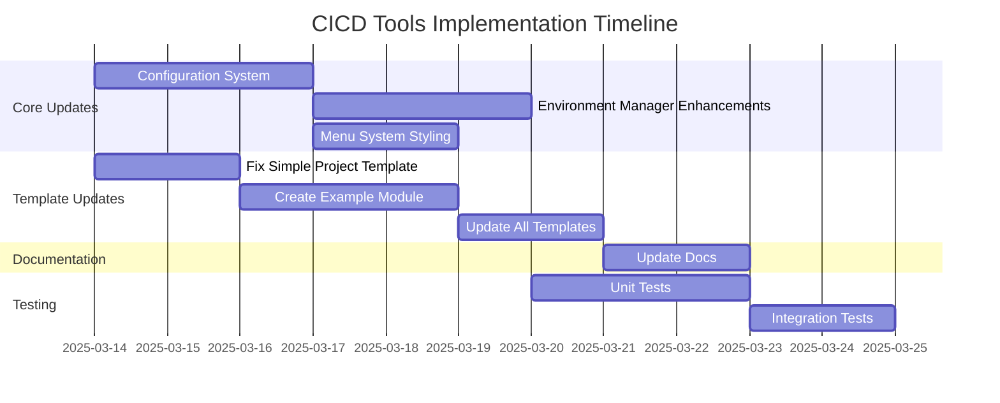

# CICD Tools - Implementation Plan for New Features

## Overview

This document outlines the plan for implementing the following new features in the cicd_tools project:

1. Enhanced menu styling and user experience
2. Restructured project templates (replacing {{ project_name.replace('-', '_') }} with sample_module)
3. Example modules with logging capabilities
4. Centralized configuration in `.app_cache/config.yaml`
5. Progress tracking for command execution with capture_output flag enabled by default

## Timeline and Dependencies



## 1. Configuration System Updates

### 1.1 Update Configuration Path

**Task:** Modify the configuration system to use `.app_cache/config.yaml` instead of `.cicd_tools_cache/config.yaml`.

**Implementation Details:**
```python
# In config_manager.py
CICD_TOOLS_CACHE_FILE = '.app_cache/config.yaml'  # Update path
```

**Changes Required:**
- Update `ConfigManager` class to use the new path
- Add migration logic to handle existing configuration files
- Ensure all code references use the new path

### 1.2 Expand Configuration Schema

**Task:** Expand the configuration schema to include logging and environment settings with capture_output enabled by default.

**Implementation Details:**
```yaml
# Default configuration structure
environment:
  capture_output: true  # Enabled by default

logging:
  default:
    level: INFO
    handlers:
      - type: console
        format: "%(asctime)s - %(name)s - %(levelname)s - %(message)s"
      - type: file
        filename: "app.log"
        format: "%(asctime)s - %(name)s - %(levelname)s - %(message)s"
        max_bytes: 10485760
        backup_count: 3

styling:
  colors:
    primary: "#007BFF"
    secondary: "#6C757D"
    success: "#28A745"
    warning: "#FFC107"
    error: "#DC3545"
```

**Changes Required:**
- Update `ConfigManager` to include methods for handling logger configuration
- Add schema validation for configuration
- Implement defaults for missing configuration entries

```python
def get_logger_config(self, name: str = "default"):
    """Get logger configuration by name."""
    logger_configs = self.get("logging", {})
    return logger_configs.get(name, logger_configs.get("default", {}))

def setup_default_config(self):
    """Set up default configuration if not present."""
    default_config = {
        "environment": {"capture_output": True},  # Enabled by default
        "logging": {
            "default": {
                "level": "INFO",
                "handlers": [
                    {
                        "type": "console",
                        "format": "%(asctime)s - %(name)s - %(levelname)s - %(message)s"
                    }
                ]
            }
        },
        "styling": {
            "colors": {
                "primary": "#007BFF",
                "secondary": "#6C757D",
                "success": "#28A745",
                "warning": "#FFC107",
                "error": "#DC3545"
            }
        }
    }
    
    # Only set defaults for keys that don't exist
    for key, value in default_config.items():
        if key not in self.config:
            self.config[key] = value
    
    self.save_config()
```

## 2. Environment Manager Enhancements

### 2.1 Integrate with progress_runner

**Task:** Enhance the BaseEnvManager usage to support progress tracking with the progress_runner and inline_output parameter.

**Implementation Details:**
```python
# In base_project.py
from env_manager import BaseEnvManager

def get_env_manager(self) -> BaseEnvManager:
    """
    Get or create an environment manager for this project.
    
    Returns:
        An environment manager instance
    """
    if self._env_manager is None:
        # Initialize environment manager with the project path
        self._env_manager = BaseEnvManager(self.project_path)
    return self._env_manager

def run_with_progress(self, *cmd_args):
    """
    Run a command with progress tracking.
    
    Args:
        *cmd_args: Command arguments
        
    Returns:
        Command output
    """
    env_manager = self.get_env_manager()
    config_manager = ConfigManager.get_config(self.project_path)
    capture_output = config_manager.get("environment", {}).get("capture_output", True)
    
    if capture_output:
        # Use progress_runner with inline_output parameter
        from progress_runner import run_with_progress
        return run_with_progress(env_manager.run, *cmd_args, inline_output=True)
    else:
        # Run directly without progress tracking
        return env_manager.run(*cmd_args)
```

**Changes Required:**
- Add progress_runner as a dependency
- Update BaseProject to include a run_with_progress method
- Update project type classes to use the run_with_progress method

### 2.2 Update Project Type Classes

**Task:** Update project type classes to use the run_with_progress method.

**Implementation Details:**
```python
# In simple_project.py
def install(self) -> bool:
    """
    Install the project.
    
    Returns:
        True if installation was successful, False otherwise
    """
    try:
        self.run_with_progress("pip", "install", "-e", ".")
        print("Successfully installed.")
        return True
    except Exception as e:
        print(f"Installation failed: {e}")
        return False
        
def test(self) -> bool:
    """
    Run tests.
    
    Returns:
        True if tests passed, False otherwise
    """
    try:
        self.run_with_progress("python", "-m", "unittest", "discover")
        print("Test finished.")
        return True
    except Exception as e:
        print(f"Tests failed: {e}")
        return False
        
def build(self) -> bool:
    """
    Build the project.
    
    Returns:
        True if build was successful, False otherwise
    """
    try:
        self.run_with_progress("python", "setup.py", "build")
        print("Build finished.")            
        return True
    except Exception as e:
        print(f"Build failed: {e}")
        return False
```

**Changes Required:**
- Update all project type classes to use the run_with_progress method
- Remove explicit capture_output parameters

## 3. Menu System Styling

### 3.1 Enhanced Menu Display

**Task:** Improve the menu display with styling, icons, and better formatting.

**Implementation Details:**
```python
# In menu_utils.py
from rich.console import Console
from rich.panel import Panel
from rich.text import Text

console = Console()

class MenuAction:
    """Represents a single menu action/option."""
    
    def __init__(self, name: str, description: str, callback: Callable, icon: str = None, **kwargs):
        """
        Initialize a menu action.
        
        Args:
            name: Name of the action (displayed in the menu)
            description: Description of the action
            callback: Function to call when the action is selected
            icon: Icon to display next to the action
            **kwargs: Additional arguments to pass to the callback
        """
        self.name = name
        self.description = description
        self.callback = callback
        self.icon = icon
        self.kwargs = kwargs

def style_text(text, style):
    """Apply style to text."""
    return Text(text, style=style)

def display_header(title, subtitle=None):
    """Display a styled header."""
    console.print(Panel(
        Text(title, style="bold blue"),
        subtitle=subtitle,
        border_style="blue"
    ))

def display_menu_item(index, name, description, icon=None, selected=False):
    """Display a styled menu item."""
    prefix = "→ " if selected else "  "
    icon_text = f"{icon} " if icon else ""
    
    if selected:
        console.print(f"{prefix}{icon_text}{style_text(name, 'bold blue')} - {description}")
    else:
        console.print(f"{prefix}{icon_text}{name} - {description}")

class Menu:
    """Base menu class to display options and handle selection."""
    
    def __init__(self, title: str, style_config: Dict = None):
        """
        Initialize a menu.
        
        Args:
            title: Title of the menu
            style_config: Styling configuration
        """
        self.title = title
        self.actions: List[MenuAction] = []
        self.style_config = style_config or {}
        
    def add_action(self, action: MenuAction) -> None:
        """
        Add a menu action to the menu.
        
        Args:
            action: The menu action to add
        """
        self.actions.append(action)
        
    def display(self) -> Optional[Any]:
        """
        Display the menu and handle user selection.
        
        Returns:
            The result of the selected action, or None if no action was selected
        """
        if not self.actions:
            print(f"No actions available for {self.title}")
            return None
            
        # Display header
        display_header(self.title, "Select an action:")
        
        # Create choices with icons
        choices = []
        for i, action in enumerate(self.actions):
            icon = action.icon or ""
            choices.append(Choice(
                title=f"{icon} {action.name} - {action.description}",
                value=i
            ))
        
        # Add a back/exit option
        choices.append(Choice(title="↩️ Back/Exit", value=None))
        
        # Show menu and get selection
        result = questionary.select(
            "Select an action:",
            choices=choices
        ).ask()
        
        # Handle Back/Exit option
        if result is None:
            return None
        
        selected_action = self.actions[result]
        return selected_action.execute()
```

**Changes Required:**
- Add styling utilities to `menu_utils.py`
- Update `MenuAction` class to include icon
- Update `Menu` class to use styling
- Add icons to menu actions in project type classes

### 3.2 Update Project Type Menus

**Task:** Update the menu actions in project type classes to include icons.

**Implementation Details:**
```python
# In simple_project.py
def get_menus(self) -> List[Dict[str, Any]]:
    """
    Get the menu actions available for this project type.
    
    Returns:
        A list of menu action dictionaries
    """
    return [
        {
            "name": "Install",
            "description": "Install the project",
            "callback": self.install,
            "icon": "📥"
        },
        {
            "name": "Test",
            "description": "Run tests",
            "callback": self.test,
            "icon": "🧪"
        },
        {
            "name": "Build",
            "description": "Build the project",
            "callback": self.build,
            "icon": "🏗️"
        },
        {
            "name": "Clean",
            "description": "Clean build artifacts",
            "callback": self.clean,
            "icon": "🧹"
        }
    ]
```

**Changes Required:**
- Update menu action definitions in all project type classes
- Add icons to all menu actions

## 4. Template System Updates

### 4.1 Fix Simple Project Template

**Task:** Replace `{{ project_name.replace('-', '_') }}` with `sample_module` in the simple_project template.

**Implementation Details:**
1. Rename the directory in the template
2. Update references in template files

**Changes Required:**
- Rename `{{ project_name.replace('-', '_') }}` directory to `sample_module`
- Update imports and references in template files
- Update template variables in copier.yaml

### 4.2 Create Example Module Template

**Task:** Create a sample module with logging for all project templates.

**Implementation Details:**
```python
# sample_module/__init__.py.jinja
"""
Example module for {{ project_name }}.

This module demonstrates proper Python package structure and logging configuration.
"""

import logging
import logging.config
import os
from pathlib import Path
import yaml

def setup_logging():
    """Configure logging based on the application configuration."""
    config_path = Path(__file__).parent.parent / '.app_cache' / 'config.yaml'
    
    if not config_path.exists():
        # Set up basic logging if config doesn't exist
        logging.basicConfig(
            level=logging.INFO,
            format='%(asctime)s - %(name)s - %(levelname)s - %(message)s'
        )
        return
        
    try:
        with open(config_path, 'r') as f:
            config = yaml.safe_load(f)
            
        logging_config = config.get('logging', {}).get('default', {})
        
        # Configure handlers
        handlers = {}
        for handler_config in logging_config.get('handlers', []):
            handler_type = handler_config.get('type')
            
            if handler_type == 'console':
                handler = logging.StreamHandler()
                handler.setFormatter(logging.Formatter(handler_config.get('format')))
                handlers[f'console_{len(handlers)}'] = {
                    'class': 'logging.StreamHandler',
                    'formatter': 'default',
                    'level': logging_config.get('level', 'INFO')
                }
                
            elif handler_type == 'file':
                # Create directory if it doesn't exist
                log_dir = Path(handler_config.get('filename', 'app.log')).parent
                if not log_dir.exists():
                    log_dir.mkdir(parents=True, exist_ok=True)
                    
                handlers[f'file_{len(handlers)}'] = {
                    'class': 'logging.handlers.RotatingFileHandler',
                    'filename': handler_config.get('filename', 'app.log'),
                    'maxBytes': handler_config.get('max_bytes', 10485760),
                    'backupCount': handler_config.get('backup_count', 3),
                    'formatter': 'default',
                    'level': logging_config.get('level', 'INFO')
                }
        
        # Create logging configuration dictionary
        logging_dict_config = {
            'version': 1,
            'formatters': {
                'default': {
                    'format': logging_config.get('format', '%(asctime)s - %(name)s - %(levelname)s - %(message)s')
                }
            },
            'handlers': handlers,
            'loggers': {
                '{{ project_name.replace('-', '_') }}': {
                    'level': logging_config.get('level', 'INFO'),
                    'handlers': list(handlers.keys()),
                    'propagate': False
                }
            },
            'root': {
                'level': 'WARNING',
                'handlers': list(handlers.keys())
            }
        }
        
        # Configure logging
        logging.config.dictConfig(logging_dict_config)
        
    except Exception as e:
        # Fall back to basic configuration if there's an error
        logging.basicConfig(
            level=logging.INFO,
            format='%(asctime)s - %(name)s - %(levelname)s - %(message)s'
        )
        logging.warning(f"Error configuring logging: {e}")

# Set up logging when the module is imported
setup_logging()

# Create logger for this module
logger = logging.getLogger('{{ project_name.replace('-', '_') }}')
```

```python
# sample_module/main.py.jinja
"""
Main functionality for the example module.

This module contains example functions with proper logging.
"""

import logging

# Get logger for this module
logger = logging.getLogger('{{ project_name.replace('-', '_') }}.main')

def process_data(data_list):
    """
    Process a list of data and return the result.
    
    Args:
        data_list: List of data to process
        
    Returns:
        Processed data result
    """
    logger.info(f"Processing {len(data_list)} items")
    
    try:
        result = sum(data_list)
        logger.debug(f"Calculation result: {result}")
        return result
    except Exception as e:
        logger.error(f"Error processing data: {e}")
        raise

def main():
    """Main function that demonstrates the example module."""
    logger.info("Starting example module main function")
    
    # Example data processing
    sample_data = [1, 2, 3, 4, 5]
    logger.debug(f"Sample data: {sample_data}")
    
    result = process_data(sample_data)
    logger.info(f"Final result: {result}")
    
    return result

if __name__ == "__main__":
    main()
```

**Changes Required:**
- Create sample_module directory in each template
- Add __init__.py.jinja and main.py.jinja to each sample_module directory
- Update template_manager.py to set up the example module during project creation

### 4.3 Create Configuration Template

**Task:** Create a default configuration file template for each project.

**Implementation Details:**
```yaml
# .app_cache/config.yaml.jinja
# Environment configuration
environment:
  capture_output: true  # Controls whether to capture command output and show progress bar
  
# Logging configuration
logging:
  default:
    level: INFO
    handlers:
      - type: console
        format: "%(asctime)s - %(name)s - %(levelname)s - %(message)s"
      - type: file
        filename: "logs/{{ project_name.replace('-', '_') }}.log"
        format: "%(asctime)s - %(name)s - %(levelname)s - %(message)s"
        max_bytes: 10485760  # 10MB
        backup_count: 3
```

**Changes Required:**
- Create .app_cache directory in each template
- Add config.yaml.jinja to each .app_cache directory

### 4.4 Update Template Manager

**Task:** Modify the `TemplateManager` class to set up example modules during project creation.

**Implementation Details:**
```python
def _setup_example_module(self, destination: Path, template_name: str):
    """
    Set up the example module in the created project.
    
    Args:
        destination: Path to the project directory
        template_name: Name of the template used
    """
    # Create .app_cache directory and default config
    app_cache_dir = destination / '.app_cache'
    app_cache_dir.mkdir(exist_ok=True)
    
    config_path = app_cache_dir / 'config.yaml'
    if not config_path.exists():
        default_config = {
            "environment": {"capture_output": True},
            "logging": {
                "default": {
                    "level": "INFO",
                    "handlers": [
                        {
                            "type": "console",
                            "format": "%(asctime)s - %(name)s - %(levelname)s - %(message)s"
                        },
                        {
                            "type": "file",
                            "filename": f"logs/{destination.name}.log",
                            "format": "%(asctime)s - %(name)s - %(levelname)s - %(message)s",
                            "max_bytes": 10485760,
                            "backup_count": 3
                        }
                    ]
                }
            }
        }
        
        with open(config_path, 'w') as f:
            yaml.dump(default_config, f, default_flow_style=False)
```

**Changes Required:**
- Add `_setup_example_module` method to TemplateManager
- Call this method after project creation
- Update the create_project and update_project methods to use this new functionality

## 5. Dependency Updates

### 5.1 Add Required Dependencies

**Task:** Update project dependencies to include required packages.

**Implementation Details:**
```python
# In pyproject.toml
[project]
# ...
dependencies = [
    "click",
    "copier",
    "questionary",
    "pyyaml",
    "rich",  # For terminal styling and progress bars
    "progress_runner",  # For progress tracking
]
```

**Changes Required:**
- Add rich package to dependencies
- Add progress_runner package to dependencies
- Ensure PyYAML is listed as a dependency for configuration handling

## 6. Testing Plan

### 6.1 Unit Tests

**Task:** Create unit tests for new functionality.

**Test Cases:**
1. **Configuration Management**
   - Test loading configuration from .app_cache/config.yaml
   - Test default configuration creation
   - Test logger configuration retrieval

2. **Environment Manager**
   - Test capture_output configuration check
   - Test progress tracking with progress_runner
   - Test command execution with inline_output

3. **Menu System**
   - Test styling utilities
   - Test menu display formatting

4. **Example Module**
   - Test logger initialization
   - Test logging configuration from config.yaml

### 6.2 Integration Tests

**Task:** Create integration tests for the end-to-end functionality.

**Test Cases:**
1. **Project Creation with Example Module**
   - Test creating projects with different templates
   - Verify sample module is created correctly
   - Test logging configuration is set up

2. **Environment Operations with Progress Tracking**
   - Test installation with progress tracking
   - Test build operations with progress tracking
   - Test test execution with progress tracking

## 7. Implementation Strategy

### 7.1 Phased Approach

The implementation will follow a phased approach:

1. **Phase 1: Core Infrastructure**
   - Update configuration system to use .app_cache
   - Implement expanded configuration schema
   - Add logging configuration support

2. **Phase 2: Template Updates**
   - Replace {{ project_name.replace('-', '_') }} with sample_module
   - Create example module templates
   - Update template manager to set up example modules

3. **Phase 3: UI Enhancements**
   - Implement enhanced menu styling
   - Add progress tracking for commands
   - Integrate styling with configuration

4. **Phase 4: Testing and Documentation**
   - Implement unit and integration tests
   - Update documentation
   - Create user guides

### 7.2 Pull Request Strategy

Each feature will be implemented in a separate branch and merged through pull requests:

1. **PR #1: Configuration System Updates**
   - Change to .app_cache/config.yaml
   - Expand configuration schema
   - Add migration for existing projects

2. **PR #2: Template System Updates**
   - Replace {{ project_name.replace('-', '_') }} with sample_module
   - Add example module to all templates
   - Update template manager

3. **PR #3: Environment Manager Enhancements**
   - Integrate with progress_runner
   - Enable capture_output by default
   - Use inline_output parameter

4. **PR #4: Menu System Styling**
   - Enhance menu display
   - Add icons and styling

5. **PR #5: Testing and Documentation**
   - Add unit and integration tests
   - Update documentation