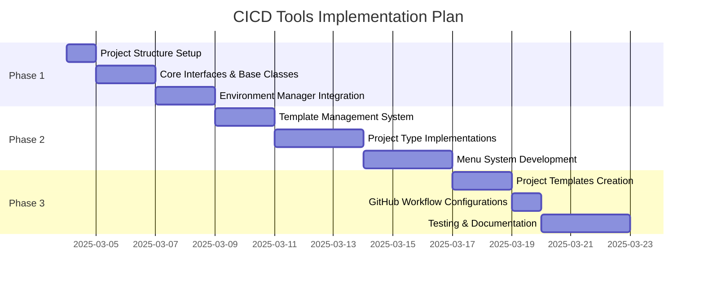

# CICD Tools Project - Implementation Plan

This document outlines the implementation plan for the CICD Tools project based on the architecture defined in `cicd_tools_architecture_plan.md`.

## Implementation Timeline



## Phase 1: Project Setup and Core Structure

### Step 1: Project Structure & Dependencies
- Create the initial directory structure as outlined in the architecture plan
- Set up pyproject.toml with necessary dependencies:
  - Questionary for interactive prompts
  - Copier for template management
  - PyYAML for YAML configuration (as specified)
  - Click for CLI interface
- Create initial package files and README

### Step 2: Core Interfaces & Base Classes
- Implement the BaseProject abstract class with required methods
- Create necessary utility modules and helpers
- Set up configuration management using YAML as the storage format

### Step 3: Environment Manager Integration
- Adapt the existing `env_manager` module for use in cicd_tools
- Implement Environment and EnvManager classes
- Create integration points with project types

## Phase 2: Key Components Implementation

### Step 4: Template Management System
- Implement TemplateManager for handling project creation and updates
- Create TemplateUtils for supporting template operations
- Define the template directory structure

### Step 5: Project Type Implementations
- Implement the three project types:
  - SimpleProject with basic functionality
  - DevelopmentProject with advanced capabilities
  - GitHubProject with GitHub integration

### Step 6: Menu System Development
- Implement the Menu and MenuAction classes
- Create CreateMenu for project creation/updating
- Develop AppMenu for project-specific operations
- Implement dynamic menu adaptation based on project type

## Phase 3: Templates & Testing

### Step 7: Project Templates Creation
- Create template directories for each project type:
  - simple_project template
  - development_project template
  - github_project template
- Define template variables and defaults

### Step 8: GitHub Workflow Configurations
- Implement the three GitHub workflow YAML configurations:
  - pytest.yml for automated testing
  - release.yml for version management
  - deploy.yml for deployment

### Step 9: Testing & Documentation
- Write comprehensive unit tests for all components
- Create integration tests for workflows
- Document usage and extension patterns

## Implementation Details For Key Components

### BaseProject Interface
```python
from abc import ABC, abstractmethod
from pathlib import Path
from typing import List, Dict, Any

class BaseProject(ABC):
    """Abstract base class for all project types."""
    
    def __init__(self, project_path: Path):
        self.project_path = project_path
        
    def get_env_manager(self):
        # Implementation to create/retrieve environment manager
        pass
        
    @abstractmethod
    def get_menus(self) -> List[Dict[str, Any]]:
        """Return list of menu actions available for this project type."""
        pass
        
    def get_env_config(self) -> Dict[str, Any]:
        """Return environment configuration for this project."""
        pass
        
    def configure_environment(self, env_type: str, env_name: str = None):
        """Configure the environment for this project."""
        pass
```

### Menu System
```python
from typing import List, Callable, Dict, Any

class MenuAction:
    """Represents a single menu action/option."""
    
    def __init__(self, name: str, description: str, callback: Callable):
        self.name = name
        self.description = description
        self.callback = callback
        
    def execute(self, *args, **kwargs):
        """Execute the menu action."""
        return self.callback(*args, **kwargs)

class Menu:
    """Base menu class to display options and handle selection."""
    
    def __init__(self, title: str):
        self.title = title
        self.actions: List[MenuAction] = []
        
    def add_action(self, action: MenuAction):
        """Add a menu action to the menu."""
        self.actions.append(action)
        
    def display(self):
        """Display the menu and handle user selection."""
        # Implementation using questionary
        pass
```

### YAML Configuration Management
```python
import yaml
from pathlib import Path
from typing import Dict, Any, Optional

class ConfigManager:
    """Manages project configuration using YAML storage."""
    
    def __init__(self, config_path: Path):
        self.config_path = config_path
        self.config: Dict[str, Any] = {}
        self._load_config()
        
    def _load_config(self):
        """Load configuration from YAML file."""
        if self.config_path.exists():
            with open(self.config_path, 'r') as f:
                self.config = yaml.safe_load(f) or {}
        
    def save_config(self):
        """Save configuration to YAML file."""
        self.config_path.parent.mkdir(parents=True, exist_ok=True)
        with open(self.config_path, 'w') as f:
            yaml.dump(self.config, f, default_flow_style=False)
            
    def get(self, key: str, default: Any = None) -> Any:
        """Get a configuration value."""
        return self.config.get(key, default)
        
    def set(self, key: str, value: Any):
        """Set a configuration value."""
        self.config[key] = value
        self.save_config()
```

## Testing Strategy

1. **Unit Tests**: Test individual components in isolation
   - Project type implementations
   - Menu system functionality
   - Configuration management
   - Template operations

2. **Integration Tests**: Test workflows and interaction between components
   - Project creation workflow
   - Environment configuration
   - Menu operation sequences

3. **End-to-End Tests**: Test the complete system
   - CLI command execution
   - Project lifecycle management

## Development Guidelines

- Follow SOLID principles as outlined in the architecture document
- Use consistent error handling across all components
- Document all public interfaces and methods
- Maintain high test coverage, especially for core components
- Use type hints throughout the codebase for better IDE support and documentation